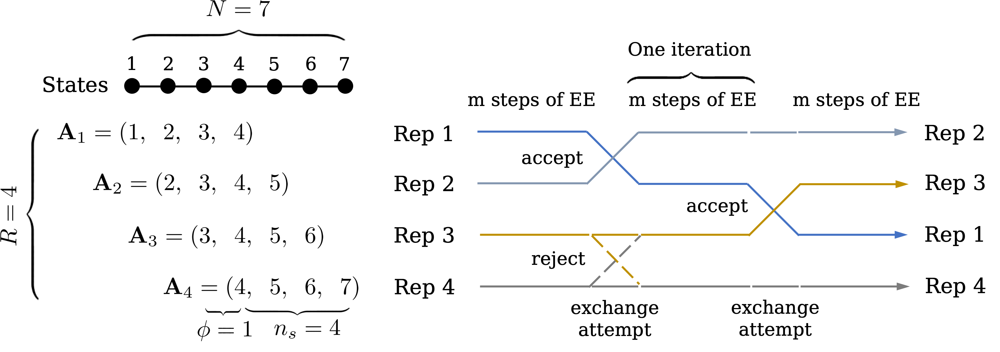
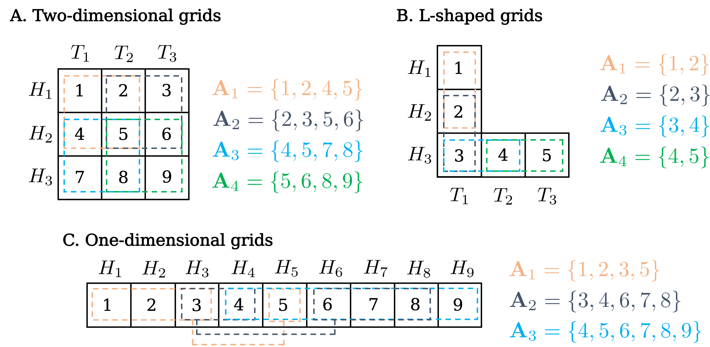
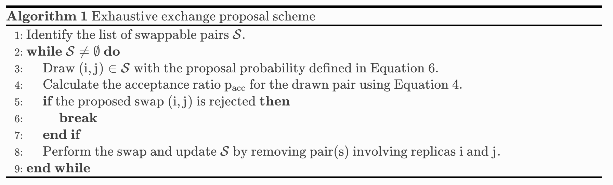

.. note:: This page is still a work in progress. Please check `Issue 41`_ for the current progress.

.. _`Issue 41`: https://github.com/wehs7661/ensemble_md/issues/41

.. _doc_basic_idea:

1. Basic idea
=============
Replica exchange of expanded ensembles (REXEE) [Hsu2024]_ integrates the core principles of replica exchange (REX)
and expanded ensemble (EE) methods.  Specifically, a REXEE simulation performs multiple
replicas of EE simulations in parallel and periodically exchanges coordinates
between replicas. Each replica samples a different but overlapping set of alchemical 
intermediate states to collectively sample the space bwteen the fully coupled (:math:`\lambda=0`)
and decoupled states (:math:`\lambda=1`). By design, the REXEE method decorrelates
the number of replicas from the number of states, enhancing the flexibility in replica configuration and 
allowing a large number of intermediate states to be sampled with significantly fewer replicas than those
required in the Hamiltonian replica exchange (HREX). By parallelizing replicas, the REXEE method also reduces
the simulation wall time compared to the EE method. More importantly, such parallelism sets the
stage for more complicated applications, especially one-shot free energy calculations that involve multiple
topologies, such as serial mutations or scaffold-hopping transformations.

In the following sections, we will briefly cover the theory behind the REXEE method, from its configuration, state
transitions, proposal schemes, weight combination schemes, to data analysis. For more details, please refer to the
paper [Hsu2024]_.

   **Figure 1.** Schematic representation of the REXEE method, with the four configurational parameters annoated. In a REXEE simulation, the coordinates of replicas
   of EE simulations are periodically exchanged. :math:`{\bf A}_1`, :math:`{\bf A}_2`, :math:`{\bf A}_3`, and :math:`{\bf A}_4`
   denote the sets of states different replicas are sampling.

2. REXEE configuration
======================
Here we consider a REXEE simulation composed of :math:`R` parallel replicas of expanded ensembles, each of which is
labeled as :math:`i=1, 2, ..., R`. These :math:`R` replicas are restricted to sampling :math:`R` different yet overlapping
sets of states (termed **state sets**) labeled by :math:`m` as :math:`{\bf A}_1`, :math:`{\bf A}_2`, ..., :math:`{\bf A}_R`,
which collectively sample :math:`N` alchemical intermediate states in total, with :math:`N > R`. Additionally, we define :math:`s_i \in \{1, 2, ..., N\}`
as the index of the state currently sampled by the :math:`i`-th replica. For a replica :math:`i` sampling state set :math:`{\bf A}_m`,
:math:`s_i` is additionally constrained such that :math:`s_i \in {\bf A}_m`. Importantly, the fact that :math:`s_i` takes values
in :math:`\{1, 2, ..., N\}` and :math:`N>R` implies a many-to-one relationship between the replica index :math:`i` and the state index
:math:`s_i`, as a certain state may be sampled by multiple replicas. This is in contrast to the one-to-one relationship between the replica
index :math:`i` and the state set index :math:`m`, which ensures that each replica is associated with one and unique state set.

We emphasize that a valid REXEE configuration only requires overlapping state sets and is not restricted to one-dimensional grids,
the same number of states for all replicas, nor sequential state indices within the same state sets. For example, Figure 2 shows cases where
intermediate states are characterized by more than one thermodynamic variable (panels A and B), where different state sets
have different number of states (panels C), and where the state indices are not consecutive within the same state sets (panels A and C).
Still, the most common case is where the intermediate states are defined in a one-dimensional space, with consecutive state indices within
the same state set (e.g., the case in `Figure 1`_). In a REXEE simulation with such a configuration, a state shift :math:`\phi` between adjacent
state sets can be defined to indicate to what extent the set of states has shifted along the alchemical coordinate. Depending on whether all replicas
have the same number of states and whether or not the state shift is consistent between all adjacent state sets, a REXEE simulation can be either
homogeneous or heterogenous. Currently, :code:`ensemble_md` has only implemented the homogeneous REXEE method with one-dimensional alchemical intermediate
states defined sequentially in each state set.

   **Figure 2.** Different possible replica configurations of a REXEE simulation, with each state represented as a grid labeled by the number in its center
   and characterized by different Hamiltonians and/or temperatures. Different state sets are represented as dashed lines in different colors.
   Note that the temperature :math:`T` and Hamiltonian :math:`H` can be replaced by other physical variables of interest, such as pressure or chemical potential.

As shown in `Figure 1`_, a homogeneous REXEE simulation that samples sequential one-dimensional states can be configured by the following four parameters:

  - :math:`N`: The total number of intermediate states
  - :math:`R`: The total number of replicas
  - :math:`n_s`: The number of states per replica
  - :math:`\phi`: The state shift between adjacent state sets

These four configurational parameters are related via the following relationship:

.. math:: N = n_s + (R-1)\phi
   :label: eq_1

For example, the configuration of the REXEE simulation shown in `Figure 1`_ can be expressed as :math:`(N, R, n_s, \phi) = (9, 4, 6, 1)`. Importantly, the total
number of states :math:`N` does not have to be equal to the number of replicas :math:`R` in the REXEE method. In fact it is shown in the Supporting Information of
our paper [Hsu2024]_ that for a REXEE simulation simulation sampling any number of replicas, there exists at least one valid REXEE
configuration, allowing much higher flexibility in replica configuration compared to traditional replica exchange methods -- once the number of replicas
is decided, typically as a factor of the number of available cores, the total number of states can be arbitrary. In our Supporting Information, 
we also show that solving Equation :eq:`eq_1` with a few additional constraints allows efficient enumeration of all possible REXEE configurations. In :code:`ensemble_md`,
this enumeration is implemented in the command line interface (CLI) command :code:`explore_REXEE`, as elaborated in :ref:`doc_explore_REXEE`.

3. State transitions in REXEE simulations
=========================================
In a REXEE simulation, state transitions occur at both the intra-replica and inter-replica levels. Within each replica of expanded ensemble simulation,
transitions between alchemical states within the state set and the detailed balance conditions are governed by the selected algorithm in the expanded ensemble simulation
(i.e., the value of the GROMACS MDP parameter :code:`lmc-stats-move` in our implementation). Still, to ensure that probability influx and outflux are equal for each sets of states,
the detailed balance condition at the intra-replica level must be satisfied.

Mathematically, we consider replicas :math:`i` and :math:`j` that sample the state sets :math:`{\bf A}_m` and :math:`{\bf A}_n`, respectively. To swap replicas :math:`i`
and :math:`j`, the state sampled by replica :math:`i` at the moment, denoted as :math:`s_i \in {\bf A}_m`, must fall within the state set :math:`{\bf A}_n` that is to be swapped,
and vice versa. In this case, we call that these replicas :math:`i` and :math:`j` are **swappable**, and we express the exchange of coordinates :math:`x_i` and :math:`x_j` between these
two replicas as

.. math:: :label: eq_2
  
  X=\left(..., x^i_{m}, ..., x^j_{n}, ...\right) \rightarrow X' = \left(..., x^j_{m}, ..., x^i_{n}, ...\right)

with :math:`x^i_m \equiv (x_i, {\bf A}_m)` meaning that the :math:`i`-th replica samples the :math:`m`-th state set with the coordinates :math:`x_i`. Mathematically, the list of swappable pairs
:math:`\mathcal{S}` can be defined as the set of replica pairs as follows:

.. math:: :label: eq_3

  \mathcal{S} = \left\{(i, j) \mid s_i \in {\bf A}_n, s_j \in {\bf A}_m, i \neq j\right\}

As discussed in the Supporting Information of the paper [Hsu2024]_, the most straightforward way to derive the acceptance ratio that satisfies the intra-replica detailed balance condition 
is to assume symmetric proposal probabilities, which can be easily achieved by the design of the used proposal scheme. (See :ref:`doc_proposal` for more details.)
Under this assumption, the acceptance ratio of swapping the coordinates :math:`x_i` and :math:`x_j` between replicas :math:`i` and :math:`j` can be expressed as

.. math:: :label: eq_4

  P_{\text{acc}} = 
    \begin{cases} 
      \begin{aligned}
        &1 &, \text{if } \Delta \leq 0 \\
        \exp(&-\Delta) &, \text{if } \Delta >0
      \end{aligned}
    \end{cases}

where

.. math:: :label: eq_5

  \Delta = \left(u_{s_i}(x_j) + u_{s_j}(x_i) \right)-\left(u_{s_i}(x_i)+u_{s_j}(x_j)\right)

In Equation :eq:`eq_5`, :math:`u_{s_i}(x_j)` and :math:`u_{s_j}(x_i)` are the reduced potentials of the states :math:`s_i` and :math:`s_j` evaluated at the coordinates :math:`x_j` and :math:`x_i`, respectively.

.. _doc_proposal:

4. Proposal schemes
===================
In this section, we discuss proposal schemes available in the current implementation of the package :code:`ensemble_md`,
each of which has a symmetric proposal probability. These proposal schemes can be specified via the option :code:`proposal` in the input YAML file (e.g., :code:`params.yaml`)
for running a REXEE simulation. For more details about the input YAML file, please refer to :ref:`doc_parameters`.

4.1. Single exchange proposal scheme
------------------------------------
The single exchange proposal scheme randomly draws a pair of replicas from the list of swappable pairs :math:`\mathcal{S}` defined in :eq:`eq_3`, with each pair in the list
having an equal probability to be drawn. In this case, the proposal probability can be expressed as follows:

.. math:: :label: eq_6

  \alpha\left(X'|X\right)= \alpha\left(x^j_{m}, x^i_{n} | x^i_{m}, x^j_{n}\right)=
    \begin{cases} 
    \begin{aligned}
      &1/|\mathcal{S}|& \text{, if } (i, j) \in \mathcal{S} \\
      & \quad 0 &\text{, if } (i, j) \notin \mathcal{S}
  \end{aligned}
  \end{cases}

In our implementation in :code:`ensemble_md`, this method can be used by setting :code:`proposal: 'single'` in the input YAML file.

4.2. Neighbor exchange proposal scheme
--------------------------------------
In the neighbor exchange proposal scheme implemented in :code:`ensemble_md` (which is enabled by setting :code:`proposal: 'neighbor'` in the input YAML file),
we add a constraint to :math:`mathcal{S}` defined in Equation :eq:`eq_3` such that the swappable pairs consist exclusively of neighboring replicas, 
with each pair having an equal probability to be drawn. Formally, the proposal probability in this case can be expressed as
follows:

.. math:: :label: eq_7

  \alpha\left(X'|X\right)= \alpha\left(x^j_{m}, x^i_{n} | x^i_{m}, x^j_{n}\right)=
    \begin{cases} 
    \begin{aligned}
      &1/|\mathcal{S}_{\text{neighbor}}|& \text{, if } (i, j) \in \mathcal{S_{\text{neighbor}}} \\
      & \quad 0 &\text{, if } (i, j) \notin \mathcal{S_{\text{neighbor}}}
  \end{aligned}
  \end{cases}

where 

.. math:: :label: eq_8

  \mathcal{S}_{\text{neighbor}} = \{(i, j)|s_i \in A_n \text{ and } s_j \in A_m \text{ and } |i-j|=1\}

4.3. Exhaustive exchange proposal scheme
----------------------------------------
As opposed to the single exchange or neighbor exchange proposal schemes, one can propose
multiple swaps within an exchange interval to further enhance the mixing of replicas. In :code:`ensemble_md`,
one available method is the exhaustive exchange proposal scheme, which can be enabled by setting :code:`proposal: 'exhaustive'` in the input YAML file.
As detailed in Algorithm 1 below, the exhaustive exchange proposal scheme operates similarly to the single exchange proposal scheme, but
exhaustively traverses the list of swappable pairs while updating the list by eliminating any pair involving replicas that
appeared in the previously proposed pair, ensuring symmetric proposal probabilities. Intuitively, the exhaustive exchange proposal
scheme leads to more efficient state-space and replica-space sampling than the other two
proposal schemes, as it potentially allows for more exchanges to occur within an exchange interval.

|

5. Correction schemes
=====================
For weight-updating REXEE simulations, we experimented a few correction schemes that aim to improve the convergence of the alchemical weights.
These correction schemes include weight combination schemes (enabled by setting :code:`w_combine: True` in the input YAML file) and histogram correction schemes
(enabled by setting :code:`hist_corr: True` in the input YAML file). While there has not been evidence showing that these correction schemes could improve the
weight convergence in REXEE simulations (as discussed in our paper [Hsu2024]_), we still provide these options for users to experiment with.
In the following sections, we elaborate on the details of these correction schemes.

.. _doc_w_schemes:

5.1. Weight combination
-----------------------
The weight combination scheme aims to leverage the statistics of the overlapping states in a REXEE simulation, i.e., the states that fall within the intersection of
at least two state sets and are therefore accessible by multiple replicas. By combining the alchemical weights of these overlapping states across replicas upon the completion of each
iteration, the weight combination scheme aims to accelerate the convergence of the weights for the entire alchemical space, providing a better starting point for the subsequent production phase.
To demonstrate, here we consider the following sets of weights 
as an example, with :code:`X` denoting a state not present in the state set:

::

    State       0         1         2         3         4         5      
    Rep A       0.0       2.1       4.0       3.7       X         X  
    Rep B       X         0.0       1.7       1.2       2.6       X    
    Rep C       X         X         0.0       -0.4      0.9       1.9

As shown above, the three replicas sample different but overlapping states. Now, our goal 
is to

* For state 1, combine the weights arcoss replicas 1 and 2.
* For states 2 and 3, combine the weights across all three replicas.
* For state 4, combine the weights across replicas 1 and 2. 

That is, we combine weights arcoss all replicas that sample the state of interest regardless 
which replicas are swapping. The outcome of the whole process should be three vectors of modified 
alchemical weights, one for each replica, that should be specified in the MDP files for the next iteration. 
Below we elaborate the details of each step carried out by our method implemented in :code:`ensemble_md`.

First, we calculate the weight differences as shown below, which can be regarded rough estimates 
of free energy differences between the adjacent states.

::

    States      (0, 1)    (1, 2)    (2, 3)    (3, 4)    (4, 5)    
    Rep 1       2.1       1.9       -0.3       X        X       
    Rep 2       X         1.7       -0.5       1.4      X       
    Rep 3       X         X         -0.4       1.3      1.0     

Note that to calculate the difference between, say, states 1 and 2, from a certain replica, 
both these states must be present in the alchemical range of the replica. Otherwise, a free 
energy difference can't not be calculated and is denoted with :code:`X`. Then, for the weight differences that are available in more than 1 replica, we take the simple 
average of the weight differences. That is, we have:

::

    States      (0, 1)    (1, 2)    (2, 3)    (3, 4)    (4, 5)    
    Final       2.1       1.8       -0.4      1.35      1.0

Assigning the first state as the reference that have a weight of 0, we have the following profile:

::
   
    Final g     0.0       2.1       3.9       3.5       4.85      5.85 

In our implementation in :code:`ensemble_md` (or more specifically, the function :code:`combine_weights` in the class :code:`ReplicaExchangeEE` in :code:`replica_exchange_EE.py`),
`inverse-variance weighted averages`_ can be used instead of simple averages used above, if uncertainties of the input weights are given.

.. _`inverse-variance weighted averages`: https://en.wikipedia.org/wiki/Inverse-variance_weighting

Finally, we need to determine the vector of alchemical weights for each replica. To do this,
we just shift the weight of the first state of each replica back to 0. As a result, we have
the following vectors:

::

    State       0           1            2            3            4            5      
    Rep 1       0.0         2.1          3.9          3.5          X            X  
    Rep 2       X           0.0          1.8          1.4          2.75         X    
    Rep 3       X           X            0.0          -0.4         0.95         1.95

As a reference, here are the original weights:

::

    State       0           1            2            3            4            5
    Rep 1       0.0         2.1          4.0          3.7          X            X
    Rep 2       X           0.0          1.7          1.2          2.6          X
    Rep 3       X           X            0.0          -0.4         0.9          1.9

Notably, taking the simple average of weight differences/free energy differences is equivalent to
taking the geometric average of the probability ratios.

5.2. Histogram correction
-------------------------
In our experiment, we tried applying histogram corrections upon weight combination across replicas to
correct the effect that the targeting distribution is a function of time. The idea is to leverage the more
reliable statistics we get from the overlapping states. In a limiting case where we have two weight-updating
EE simulations sampling the same set of states, the way we take full advantage of all the samples collected
in two simulations is to consider the histogram of both simulations and base the flatness criteria on the
sum of the histograms from both simulations, in which case the weights should then equilibrate faster
than a single weight-updating EE simulation. Below we demonstrate/derive the histogram correction method implemented in
:code:`ensemble_md` with an example.

Specifically, we consider replicas A and B sampling states 0 to 4 and states 1 to 5, respectively. At time :math:`t`,
these two replicas have the following weights for their state sets.

::

    Alchemical weights

    State         0         1         2         3         4         5
    Rep A         0         4.00      10.69     12.18     12.52     X
    Rep B         X         0         5.15      7.14      8.48      8.16

And the histogram counts at time :math:`t` are as follows

::

    Histogram counts
    State         0         1         2         3         4         5
    Rep A         416       332       130       71        61        X
    Rep B         X         303       181       123       143       260

During weight combination, for states 1 and 2, we calculate the following average weight difference:

.. math:: :label: eq_9
  
  \Delta f'_{21}=\frac{1}{2}\left(\Delta f^{A}_{21} + \Delta f^{B}_{21}\right)=\frac{1}{2}\left(\ln\left(\frac{p^A_1}{p^A_2}\right) +\ln\left(\frac{p^B_1}{p^B_2}\right)\right)=\ln\left[\left(\frac{p^A_1 p^B_1}{p^A_2 p^B_2}\right)^{1/2}\right]
  
Let :math:`\Delta f'_{21}=\ln\left(\frac{N_1'}{N_2'}\right)`. We then have 

.. math:: :label: eq_10

  \frac{N_1'}{N_2'}=\left(\frac{p^A_1 p^B_1}{p^A_2 p^B_2}\right)^{1/2}

In synchronous REXEE simulations, each replica should have the same total amount of counts, so the normalization constant for replicas A
and B are the same, i.e., :math:`p^A_1 = N^A_1/N`, :math:`p^B_1 = N^B_1/N`, ... etc. Therefore, we have 

.. math:: :label: eq_11

  \frac{N_1'}{N_2'}=\left(\frac{N^A_1 N^B_1}{N^A_2 N^B_2}\right)^{1/2}

That is, the ratio of corrected histogram counts should be the geometric mean of the ratios of the original histogram counts.
Using the numbers above, we calculate the ratios of histogram counts for all neighboring states. That is, for states accessible by multiple replicas, we
calculate the geometric mean of the values of :math:`N_{i+1}/N_i`` from different replicas. Otherwise, we simply calculate :math:`N_{i+1}/N_i`. 

::

    States     (0, 1)     (1, 2)       (2, 3)       (3, 4)       (4, 5)
    Final       0.798      0.484        0.609        0.999       1.818            

Note that given :math:`N_1`, we can get :math:`N_2`` by calculating :math:`N_1 \times \frac{N_2}{N_1}` and get :math:`N_2` by calculating 
:math:`N_1 \times \frac{N_2}{N_1} \times \frac{N_3}{N_2}` and so on. So the histogram counts of the whole set of states would be as follows:

::

    Final N    416    332    161    98    98    178

 The above distribution can be used to derive the distribution for each state set easily:

::

    States    0     1     2     3     4     5
    Rep A     416   332   161   98    98
    Rep B     X     332   161   98    98    178

Note that originally the total histogram counts per replica was 1010, and now the total counts for replicas A and B are 1105 and 867.
To understand how the total number of histogram counts would influence the equilibration time, we consider the following simple case:
In an EXE simulation for a two-state system with :code:`wl-ratio=0.8`, if states 0 and 1 have counts of 50 and 100, respectively,
the Wang-Landau ratio for states 0 and 1 would be 50/75 = 0.67 and 1.33, respectively. To reach a flatness ratio of 0.8 for state 0,
we at least need 17 more counts in state 0 (:math:`67/(0.5 \times (67+100))=0.802$`). On the other hand, if we have counts 500 and
1000 for states 0 and 1, we would need 167 more counts in state 0, so the equilibration time would be longer. I might need a better justification,
but I think for now it should be fine to not rescale the count for each state to match the total counts? However, if the weight combination is
based on averaged weights, we might need to rescale since the total histogram counts would not stay the same as the time goes ...

5.3. Our experience with the correction schemes
-----------------------------------------------
As per our experiments with the correction schemes (also partly discussed in our paper [Hsu2024]_),
here are some interesting observations about the correction schemes:

- Generally, the application of weight combination schemes would lengthen the weight convergence time for a 
  weight-updating REXEE simulation, without necessarily converging to more accurate weights, as compared to running
  a weight-updating EE simulation for each state set.
- Interestingly, in terms of the weight convergence time and the weight accuracy, here is the ranking of the performance
  of different combinations of the correction schemes, with the best performance listed first:
  - No correction schemes at all, i.e., weight-updating EE simulation for each state set.
  - Weight combination with simple averages + histogram correction
  - Weight combination with simple averages
  - Weight combination with inverse-variance weighted averages
- We reason these observations that combining weights does not improve convergence is because the exchanges of coordinates between replicas have already caused each
  replica to visit all of the configurations that started with different replicas, and thus have
  “seen” the different configurations and incorporated them into the accumulated weights.
  Therefore, additionally combining weights across replicas may not provide any additional
  advantage. In addition, small changes in weights can drastically affect sampling,
  as state probabilities are exponential in the free energy differences between states.
  If one of the weights being combined is particularly bad, it will disrupt sampling for the other
  weights, and will therefore lower the convergence rate. For more details about the experiments, please refer to our paper [Hsu2024]_.

6. Free energy calculations
===========================

